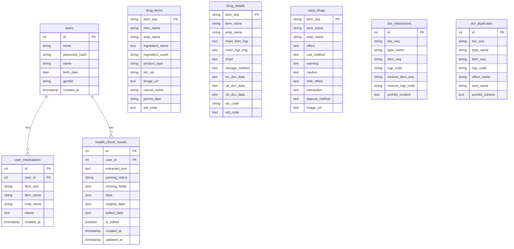

# Database

이 문서는 Health Navigator-Management 백엔드의 DB 구조, parquet 원본 데이터 적재 방식, 의약품 조회 및 검사 기준을 정리합니다.

## DB 구조

현재 DB 모델은 SQLAlchemy 기준으로 다음 테이블로 구성되어 있습니다. 아래 ERD는 주요 컬럼만 표시했습니다.

기존 MySQL 데이터베이스에 이미 `users` 테이블이 생성되어 있다면 SQLAlchemy `create_all`만으로 `birth_date`, `gender` 컬럼이 자동 추가되지는 않습니다. 기존 DB에는 별도 `ALTER TABLE` 적용 또는 테이블 재생성 절차가 필요합니다.

의약품 관련 테이블은 SQLAlchemy `ForeignKey`로 직접 연결되어 있지는 않습니다. 서비스 로직에서 `item_seq`, `ingr_code`, `mixture_item_seq`, `mixture_ingr_code`, `atc_code`, `effect_name`, `sers_name` 값을 기준으로 조회와 비교를 수행합니다.

건강검진 OCR 결과는 `health_check_results`에 저장합니다. 초기 구현은 OCR 결과 구조 변경에 대응하기 위해 건강검진 수치와 판정 결과 전체를 JSON에 저장합니다. 최초 OCR 파싱 결과는 `original_data`, 현재 최종 결과는 `data`, 수정 후 결과는 `edited_data`에 저장합니다. 특정 수치별 검색이나 통계가 필요해지면 주요 항목을 별도 컬럼으로 분리하는 방향을 검토합니다.

## Parquet 원본 데이터 적재

초기 원본 데이터는 `health-navigator-backend/app/data`의 parquet 파일로 관리했습니다. 이후 `health-navigator-backend/scripts/import_drug_data.py`를 통해 필요한 컬럼을 MySQL 테이블로 적재하는 구조로 전환했습니다.

| 원본 parquet | 적재 테이블 | 주요 적재 컬럼 |
| --- | --- | --- |
| `permit_list.parquet` | `drug_items` | `ITEM_SEQ`, `ITEM_NAME`, `ENTP_NAME`, `ITEM_INGR_NAME`, `ITEM_INGR_CNT`, `PRDUCT_TYPE`, `SPCLTY_PBLC`, `BIG_PRDT_IMG_URL`, `CANCEL_NAME`, `ITEM_PERMIT_DATE`, `EDI_CODE` |
| `permit_detail.parquet` | `drug_details` | `ITEM_SEQ`, `ITEM_NAME`, `ENTP_NAME`, `MAIN_ITEM_INGR`, `MAIN_INGR_ENG`, `CHART`, `STORAGE_METHOD`, `VALID_TERM`, `PACK_UNIT`, `EE_DOC_DATA`, `UD_DOC_DATA`, `NB_DOC_DATA`, `ATC_CODE`, `EDI_CODE`, `ETC_OTC_CODE`, `CANCEL_NAME`, `ITEM_PERMIT_DATE` |
| `easy_drug.parquet` | `easy_drugs` | `itemSeq`, `itemName`, `entpName`, `efcyQesitm`, `useMethodQesitm`, `atpnWarnQesitm`, `atpnQesitm`, `seQesitm`, `intrcQesitm`, `depositMethodQesitm`, `itemImage`, `openDe`, `updateDe` |
| `dur_taboo.parquet` | `dur_interactions` | `DUR_SEQ`, `TYPE_NAME`, `ITEM_SEQ`, `ITEM_NAME`, `ENTP_NAME`, `INGR_CODE`, `INGR_KOR_NAME`, `MIXTURE_ITEM_SEQ`, `MIXTURE_ITEM_NAME`, `MIXTURE_ENTP_NAME`, `MIXTURE_INGR_CODE`, `MIXTURE_INGR_KOR_NAME`, `PROHBT_CONTENT`, `REMARK`, `NOTIFICATION_DATE` |
| `dur_duplicate.parquet` | `dur_duplicates` | `DUR_SEQ`, `TYPE_NAME`, `ITEM_SEQ`, `ITEM_NAME`, `ENTP_NAME`, `INGR_CODE`, `INGR_NAME`, `INGR_ENG_NAME_FULL`, `EFFECT_NAME`, `SERS_NAME`, `PROHBT_CONTENT`, `REMARK`, `NOTIFICATION_DATE` |

## 의약품 조회 기준

### 목록/검색

- `drug_items` 테이블을 기준으로 조회합니다.
- 목록 조회는 `cancel_name == "정상"` 조건을 적용합니다.
- 정렬 기준은 `item_name`, `item_seq`입니다.
- 검색은 `item_name LIKE "%검색어%"` 또는 `item_seq LIKE "%검색어%"` 조건을 사용합니다.

### 상세 조회

- `item_seq`를 기준으로 `drug_items`, `drug_details`, `easy_drugs`에서 각각 데이터를 조회합니다.
- 세 테이블의 결과를 하나의 응답으로 합쳐 `itemName`, `ingredient`, `effect`, `useMethod`, `warning`, `sideEffect`, `storage`, `atcCode` 등을 구성합니다.

## 병용금기 검사 기준

- 직접 선택한 현재 복용약 목록 `current_item_seqs`와 새로 추가할 약 `new_item_seq`를 비교합니다.
- 1차 검사는 `dur_interactions.item_seq`와 `dur_interactions.mixture_item_seq` 조합을 기준으로 수행합니다.
- 양방향 조합을 모두 확인합니다.
  - `item_seq in current_item_seqs` and `mixture_item_seq == new_item_seq`
  - `mixture_item_seq in current_item_seqs` and `item_seq == new_item_seq`
- 2차 검사는 성분 코드 기준으로 수행합니다.
  - 현재 약의 `ingr_code`
  - 새 약의 `mixture_ingr_code`
  - 또는 그 반대 조합
- 결과에는 `type`, `drugASeq`, `drugBSeq`, `ingredientA`, `ingredientB`, `reason`을 포함합니다.

## 중복 복용 검사 기준

현재 중복 복용 검사는 네 가지 기준을 사용합니다.

- 같은 `item_seq`가 2회 이상 선택되었는지 확인
- `DurDuplicate.ingr_code`와 `DurInteraction.ingr_code`에서 수집한 성분 코드가 중복되는지 확인
- `DrugDetail.atc_code`가 같은 약이 2개 이상 있는지 확인
- `DurDuplicate.effect_name`, `DurDuplicate.sers_name` 조합이 같은 약이 2개 이상 있는지 확인

사용자 복용약 기준 검사는 `user_medications`에서 현재 사용자의 `item_seq` 목록을 가져온 뒤, 새로 선택한 약 목록과 합쳐 위 병용금기/중복 복용 검사 로직을 재사용합니다.
